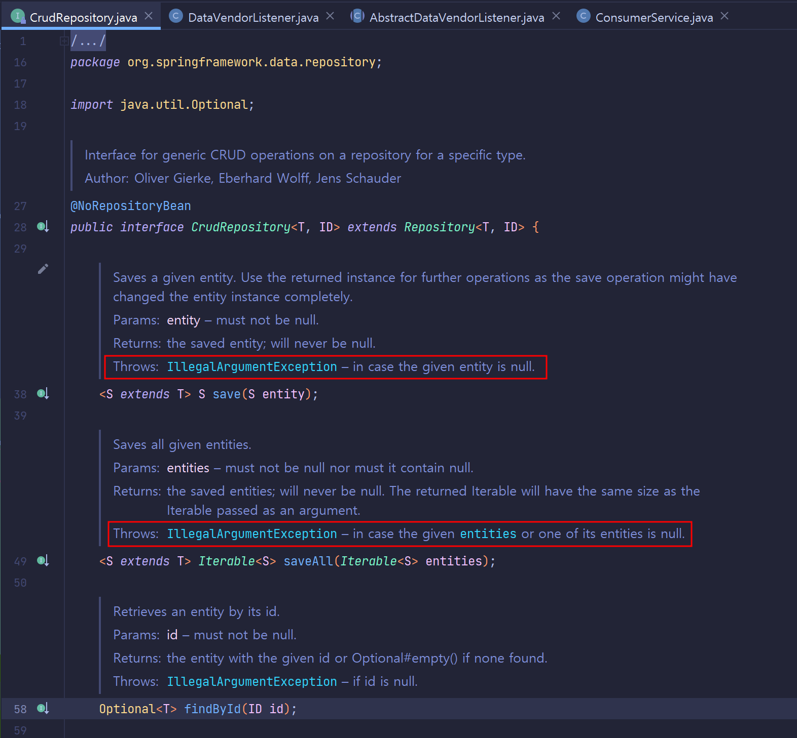

# Item 74. 메서드가 던지는 모든 예외를 문서화하라
{: .no_toc }

가급적 예외를 던지도록 선언한다면, Checked Exception 은 항상 따로 따로 선언하고, Java Doc 의 `@throwas` 태그를 사용해서 문서화하는 것이 좋다.<br>
<br>

## Table of contents
{: .no_toc .text-delta }

1. TOC
{:toc}

---

<br>

### 참고자료
{: .fs-6 .fw-700 }

- [이펙티브 자바 3/E](http://www.yes24.com/Product/Goods/65551284)
- [Effective Java 한국어판 예제 깃헙](https://github.com/WegraLee)
- [조슈아 블로크 Effective Java 깃헙](https://github.com/jbloch/effective-java-3e-source-code/tree/master/src/effectivejava)
  <br>
<br>

### 핵심정리
{: .fs-6 .fw-700 }
메서드가 던질 가능성이 있는 모든 예외를 문서화하라. 검사예외든 비검사 예외든 추상메서드든 구체 메서드든 모두 마찬가지다. 문서화에는 자바독의 `@throws` 태그를 사용하면 된다. 검사예외만 메서드 선언의 `throws` 문에 일일이 선언하고, 비검사 예외는 메서드 선언에는 기입하지 말자. 발생가능한 예외를 문서로 남기지 않으면 다른 사람이 그 클래스나 인터페이스를 효과적으로 사용하기 어렵거나 심지어 불가능할 수 도 있다.<br>
<br>

### 메서드 선언시 가급적 상위타입 예외로 얼버무리지 말자
{: .fs-6 .fw-700 }
> 제목의 억양이 다소 강해서 놀랄수도 있는데, 책에서 그대로 가져온 문구다.(내 의견을 배제함)
<br>

그 예외에 대해서 `Exception` , `Throwable` 을 던진다고 대충 얼버무리듯이 상위타입으로 얼버무려 선언하는 일을 삼가하기를 책에서 언급하고 있다.<br>

이렇게 하면, 메서드 사용자에게 각 예외에 대처할 수 있는 힌트를 주지 못하고, 같은 맥락에서 발생할 여지가 있는 다른 예외들도 삼켜버릴 수 있어서 API 사용성을 크게 떨어뜨리게 된다.<br>

단, main 문의 경우는 예외다. main 은 오직 JVM 만이 호출하기에 Exception 을 던지도록 선언해도 된다.<br>
<br>
<br>

### Unchecked Exception 도 Checked Exception 만큼 문서화하는 것은 좋은 방식이다.
{: .fs-6 .fw-700 }
Unchecked Exception 은 일반적으로 프로그래밍 오류를 의미한다. 따라서 자신이 일으킬수 있는 예외가 무엇인지 알려주게 된다면, 관련 로직에 연관된 담당자들이 자연스럽게 오류가 나지 않도록 코딩할 수 있게 된다.<br>

Unchecked Exception 이 발생할 수 있다고 문서를 잘 정리두면, 메서드가 잘 수행되게끔 하는 하나의 조건을 만들어둘 수 있다.<br>

발생 가능한 비검사 예외를 문서로 남기는 것은 강제 상황은 아니지만, 인터페이스 메서드에서 특히 중요하다.<br>
<br>

### 인터페이스의 메서드에 대한 Unchecked Exception 에 대한 규약을 남기는 것 
{: .fs-6 .fw-700 }
예를 들면, JPA 의  대표적인 interface 인 CrudRepository 를 예로 들어보면 아래와 같이 Unchecked Exception 들에 대해서 어떤 경우에 예외를 던지는지 명확하게 언급하고 있다.<br>


이렇게 해두면, CrudRepository 를 implement 하는 구현체들에도 일관된 규약을 적용할 수 있게 된다.
<br>

### 자바독의 `@throws`
{: .fs-6 .fw-700 }
자바가 제공하는 유틸리티 내에는 javadoc 역시 존재한다. javadoc 유틸리티를 활용하면 메서드 선언의 @throws 태그에 대해 별도로 표시를 해준다. 역시 글로만 설명하면 조금 이상하다.<br>
(참고 : [javadoc @throws, @exception 태그](https://araikuma.tistory.com/663) )<br>
자바독의 기능에 대해서는 다른 챕터에서 설명할 예정이지만, 간단하게나마 예제를 정리해두고 넘어가보면 이렇다.<br>
아래와 같은 인터페이스를 작성했다고 해보자.<br>
<br>

```java
import java.util.List;

public interface SomethingRepository {

    /**
     * @param id  An Identifier for something
     * @return  List of String for something
     * @throws IllegalArgumentException - in case the given entity is null
     */
    public List<String> findSomethingAll(Long id);
}
```
