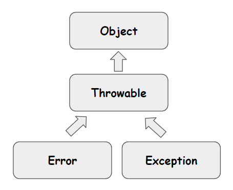
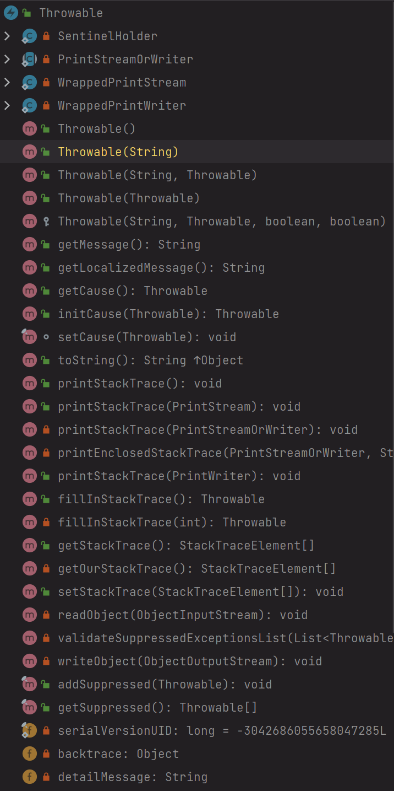
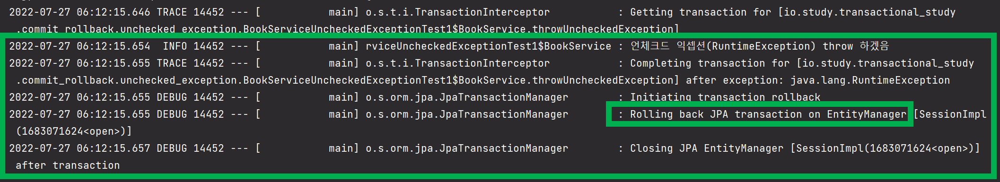

# Java 기본상식 (2023.03)
{: .no_toc }

## Table of contents
{: .no_toc .text-delta }

1. TOC
{:toc}

---

<br>

### 참고자료
{: .fs-6 .fw-700 }
<br>
<br>

### final, finalize, finally
{: .fs-6 .fw-700 }

#### final 클래스란
{: .fs-5 .fw-700 }
상속을 금지시킨 클래스다.<br>
어떤 클래스를 다른 프로그래머가 상속 받아서 사용하는 것을 금지시키고자 할 때 사용<br>
보안상의 이유 때문에 사용한다.<br>
<br>

이론 적으로는 중요한 class 의 subclass 를 만들어서 subclass 로 하여금 시스템을 파괴할 수 있기 때문에 Java 시스템은 중요한 class 에 대해 final 로 선언하고 있다. 예를 들면 String 클래스를 예로 들 수 있다.<br>
<br>
final class 로 선언되면 상속받을 수 없기 때문에 당연히 내부의 모든 method 는 overriding(재정의)될 수 없다.<Br>
<br>
<br>
**Human.java**<br>

```java
public final class Human {
    public int age;
    
    public void setAge(int age){
        this.age = age;
    }
}
```

<br>


**Student.java**<br>

에러가 발생한다. (The type Student cannot subclass the final class Human)

```java
public class Student extends Human { // 컴파일 에러. Human 클래스는 final 로 선언되었다.
    public int num;
    
    public int getNum(){
        return num;
    }
}
```

<br>


#### final 메서드
{: .fs-5 .fw-700 }

오버라이딩을 금지시킨 메서드.
final 클래스가 아닌 일반 class 에서 특정 메서드만 오버라이딩 할 수 없게 하려는 경우 오버라이딩을 금지시키고자 하는 메서드에 final 키워드를 붙인다.
이렇게 하면 그 메서드는 오버라이딩이 불가능하다.<br>
final method 는 왜 사용할까?
부모 클래스에서 정의한 method 기능을 자식 클래스가 그대로 쓰게하고 싶을 때 사용한다.
예를 들어 부모 클래스에 입으로 말하는 것에 대해 정의된 speak() 메서드가 존재하는 경우를 생각해보자.
이때 상속받은 자식 클래스가 speak() 메서드를 재정의해서 손으로 말하도록 기능을 바꾸게 되는 경우도 있을 수 있다. 이런 것을 방지하고자 할 때 사용한다.<br>
<br>

e.g.
Human.java
```java
public class Human {
    public int age;
    
    public final void setAge(int age){
        this.age = age;
    }
}
```
<br>
<br>

Student.java
```java
public class extends Human {
    public final void setAge(int age){ // 여기서 에러가 난다. 위의 Human 클래스의 setAge 메서드가 final 메서드로 선언되었기 때문에 오버라이딩이 불가하다.
        
    }
}
```
<br>
<br>

#### 불변객체, final
{: .fs-5 .fw-700 }

불변객체는 객체가 생성된 이후로 내부의 상태가 변하지 않는 객체를 의미한다.
- 원시타입의 멤버필드의 경우 단순하게 final 키워드와 함께 선언하면, 불변타입으로 선언가능하다
- 다만, 참조 타입의 멤버필드가 선언되어 있을 경우 final 로 선언했다라도 추가적으로 작업을 해줘야 한다.
<br>
<br>

##### 참조타입을 불변객체로 만들기 위해 해주는 작업들
{: .fs-4 .fw-700 }
일반 객체 일 경우, 배열/List와 같은 타입일 경우 이렇게 두가지 경우로 나누어서 불변객체 처리를 해줄수 있다.

- 일반객체
- 배열/리스트 등의 자료구조
  - 조회시에는 쉽게 설명하면 값의 복사본을 생성해서 반환해야 한다.
  - 수정 시에는 파라미터로 전달된 전달된 배열/리스트의 각 요소 값을 복사한 새로운 값으로 멤버필드에 저장해준다.
  - 배열, 리스트의 경우 내부를 복사해서 전달하는 이런 방식을 **방어적 복사(defensive-copy)**라고 한다.
<br>

참조변수가 일반객체일 경우
- 객체를 사용하는 필드의 참조 변수도 불변 객체로 변경해야 한다.
<br>
참조 변수가 배열/리스트 등의 자료구조일 경우
- 배열 일 경우 배열을 받아서 copy 해서 저장하고, getter에서는 clone 메서드를 통해 반환하도록 해준다.
- 배열을 그대로 참조하거나 반환할 경우, 외부에서 내부 값을 변경할수 있다. 따라서 clone 을 통해 복사한 값을 반환해서 원본 값을 변경하지 못하게 해야 한다.
- 리스트일 경우에도 배열과 마찬가지로 생성시에 새로운 List 를 만들어 값을 복사하게끔 해줘야 한다.
<br>
<br>


##### 불변객체의 장점
{: .fs-4 .fw-700 }

**Thread Safe**<br>
- 병렬 프로그래밍에 유용하고, 동기화를 고려하지 않아도 된다.
<br>

**실패 원자적인 메서드를 만들수 있다.**<br>
- 실행 중에 예외가 발생해도 메서드 호출 전의 상태를 유지할 수 있기 때문에 예외가 발생하기 전의 상태로 다음 로직을 처리가능하다.
<br>

**부수효과를 피해서 오류를 최소화할 수 있다.**<br>
- 부수효과: 
  - 변수의 값이 변하거나, 객체의 필드 값이 변경되는 것으로 인해 예외 또는 오류가 발생해서 실행이 중단되는 현상
<br>

**메서드 호출 시 파라미터 값이 변하지 않는다는 것을 보장 가능**<br>
<br>

**가비지 컬렉션 성능을 높일 수 있다.**<br>
- 가비지 컬렉터가 스캔하는 객체의 수가 줄어들기 때문에 GC 수행시 지연시간이 줄어든다.
- (아래 내용 참고)
<br>
<br>

##### 불변객체가 가비지컬렉션의 성능을 높일 수 있는 이유
{: .fs-4 .fw-700 }
참고자료 : [Java 불변 객체](https://velog.io/@bey1548/JAVA-%EB%B6%88%EB%B3%80%EA%B0%9D%EC%B2%B4)
<br>

불변객체를 생성할 때 내부적으로 수행되는 작업은 이렇다. 

1\) 먼저 해당 타입의 객체를 생성한다. 

2\) 해당 타입에 대한 컨테이너 객체로 ImmutableHolder 객체를 생성한다. 이렇게 생성된 ImmutableHolder 객체를 보통 **컨테이너**라고 이야기한다.

3\) 이렇게 생성된 ImmutableHolder 컨테이너 객체는 항상 해당 타입에 대한 value 객체를 참조한다.
<br>

GC 수행시 가비지 컬렉터는 이렇게 생성된 컨테이너 하위의 불변객체들을 스킵한다. 해당 타입에 대한 ImmutableHolder 라는 불변 객체 컨테이너가 살아있다는 것은 결국 해당 불변 객체 컨테이너 내의 모든 객체들은 처음에 할당된 그 상태로 참조되고 있음을 보장한다는 것을 의미한다. 

가비지 컬렉터는 이런 불변객체에 대한 컨테이너 하위의 객체들은 스캐닝을 스킵하게 된다. 결국 불변객체를 사용하면 가비지 컬렉터가 스캔해야 하는 객체의 수가 줄어들게 된다. 따라서 GC가 수행되더라도 지연시간을 줄일 수 있다.<br>
<br>

이 때 GC 가 수행될때 가비지 컬렉터는 컨테이너 하위의 불변객체들은 skip 할 수 있도록 도와준다. 해당 불변 컨테이너 객체 (ImmutableHolder) 가 살아있다는 것은 하위의 객체들도 모두 처음에 할당된 그 상태로 참조되고 있다는 것을 의미하기에, 가비지 컬렉터는 이 컨테이너 하의의 불변객체들을 스캐닝을 덜 하고, skip 하게 된다.<br>

따라서, 불변객체를 사용하면 가비지컬렉터가 스캔해야 하는 객체의 수가 줄어서 스캔해야 하는 메모리의 영역과 빈도수도 줄어든다. 따라서 GC가 수행되어도 지연시간을 줄일 수 있다.<br>
<br>


#### 불변클래스
{: .fs-5 .fw-700 }

참고자료 : [Java 불변 객체](https://velog.io/@bey1548/JAVA-%EB%B6%88%EB%B3%80%EA%B0%9D%EC%B2%B4)<br>


아래의 규칙에 따라 정의한 클래스를 **불변 클래스**라 한다.

- 클래스를 final 로 선언하라
- 클래스 내의 모든 변수를 private과 final 로 선언하라
- 객체를 생성하기 위한 생성자 또는 정적 팩토리 메서드를 추가하라
- 참조에 의한 변경가능성이 있는 경우 방어적 복사를 이용해 전달하라.

<br>

e.g. ImmutableClass.java
```java
public final class ImmutableClass{
    private final int age;
    private final String name;
    private final List<String> list;
    
    private ImmutableClass(int age, String name){
        this.age = age;
        this.name = name;
        this.list = new ArrayList<>();
    }
    
    public static ImmutableClass of(int age, String name){
        return new ImmutableClass(age, name);
    }
    
    public int getAge(){return age;}
    public String getName(){return name;}
    public List<String> getList() {
        return Collections.unmodifieableList(list);
    }
}
```

정적 팩토리 메서드
- 내부 생성자를 만드는 대신 객체의 생성을 위해 정적 팩토리 메서드를 정의했다.
- 또한 List와 같은 컬렉션 타입의 경우 list를 방어적 복사를 통해 제공했다.
<br>

기본생성자의 위험함 -> 기본생성자를 private으로 지정하고 정적 팩토리 메서드로 제공

- Java 는 생성자를 선언하지 않으면 기본 생성자가 자동으로 생성된다.
- 이 경우 다른 클래스에서 기본생성자를 자유롭게 호출가능하게 된다.
- 이런 경우에 대해 정적 팩토리 메서드를 통해 객체를 생성하도록 강제하면 좋다.
<br>

참조를 통해 변경이 가능한 경우 방어적 복사
- List와 같은 타입의 경우 객체 생성시 list 를 방어적 복사를 통해 생성

<br>
<br>


### 추상클래스, 인터페이스 (...정리 예정)
{: .fs-6 .fw-700 }
<br>
<br>

### 클래스, 객체
{: .fs-6 .fw-700 }

#### 생성자
{: .fs-5 .fw-700 }
객체를 생성할 때 사용하는 연산자.
클래스 정의시 생성자를 정의하지 않으면 기본생성자가 기본으로 생성된다.
생성자는 클래스와 같은 이름을 가지고 있다.
생성자는 오버로딩이 가능하다.
생성자가 복잡해질 때는 계층적 생성자(telescoping constructor)라고 불리는 방식을 사용하기도 한다.
객체 생성시 JVM이 내부적으로 생성자 영역을 locking 한다. (thread 영역)
<br>
<br>

#### 클래스 멤버 변수 초기화 순서
{: .fs-5 .fw-700 }
클래스 멤버 변수 초기화 순서에 대해 설명해주세요
1 ) static 변수 선언부
- 클래스 로드 시 static 필드 선언부가 가장 먼저 초기화 된다.
2 ) 필드 변수 선언부
- 객체가 생성시 생성자 영역 보다 먼저 초기화 된다.
3 ) 생성자 영역
- 객체 생성시 JVM이 내부적으로 생성자 영역을 locking 한다. (thread safe 영역)
<br>
<br>

#### Inner Class 란
{: .fs-6 .fw-700 }

클래스 내부에 선언된 또 하나의 클래스를 의미한다.
라이브러리들에서 흔히 자주 볼수 있는 Builder 패턴 들이 주로 Inner Class 를 사용하고 있는 하나의 예다.<br>

Builder 패턴이 아니더라도 Inner Class 를 사용한 클래스 중 우리 주변에서 가장 쉽게 찾아볼수 있는 클래스로는 `ResponseEntity<E>` 가 있다. 이 클래스도 내부를 열어보면 DefaultsBuilder 라는 Inner Class 가 있다. `MediaType` 역시 겉으로 보기에는 마치 enum 처럼 느껴지지만, 내부 구현은 Inner Class 단위로 논리적인 단위를 구분하고 있다.<br>
<br>

**e.g. ResponseEntity**
```java
public class ResponseEntity<T> extends HttpEntity<T> {
    
    // ...
    
    public static BodyBuilder status(HttpStatus status) {
		Assert.notNull(status, "HttpStatus must not be null");
		return new DefaultBuilder(status);
	}
    
    // ...
    
    private static class DefaultBuilder implements BodyBuilder {
        
        // ...
        
        public DefaultBuilder(Object statusCode){
            this.statusCode = statusCode;
        }
        
        // ... 
        
        @Override
		public BodyBuilder header(String headerName, String... headerValues) {
			for (String headerValue : headerValues) {
				this.headers.add(headerName, headerValue);
			}
			return this;
		}
        
        // ...
        
    }
}
```
<br>
<br>

#### Inner Class 의 장점
{: .fs-6 .fw-700 }

##### 1\) 클래스를 논리적으로 그루핑
{: .fs-5 .fw-700 }
- Builder 패턴을 예로 들어보면, 객체의 필드들을 세팅해주는 역할을 Builder 라는 클래스가 내부 클래스에서 전담하도록 정의한다. 즉, 클래스 내부에 Inner Class (내부 클래스)를 두어서 필드의 값을 바인딩하는 것과 객체를 생성하는 동작을 분리하고 있다.
<br>
<br>

##### 2\) 캡슐화
{: .fs-5 .fw-700 }
- Inner Class 를 private 접근제한자로 지정해 내부에서만 접근하도록 캡슐화를 이뤄낼 수 있다.
- 캡슐화를 통해 원하는 **주요로직의 접근을 차단하면서 내부 클래스에서 외부 클래스의 멤버들을 제약할 수 있기에, 객체로의 잘못된 접근을 차단**할 수도 있다.
- 클래스의 구조를 단순화 해주는 것 역시 장점이다.
<br>
<br>

##### 3\) 가독성이 좋고 유지보수가 쉬워진다.
{: .fs-5 .fw-700 }
- Inner Class 를 사용하면 클래스를 외부에 따로 작성하는 것 보다 의미적으로 연관관계를 유추할 수 있다는 장점을 제공하기에 유지보수에 이점을 제공해준다.
- Inner Class 에서 외부 클래스의 멤버에 자유롭게 접근할 수 있다는 점을 활용하면, 객체 내부에서만 접근할 로직을 자유롭게 구성할 수 있고, 외부에 공개하지 않아도 되는 부분을 감출수 있기에 코드의 복잡성을 줄일 수 있다.
<br>
<br>


### 제너릭
{: .fs-6 .fw-700 }

#### 제너릭의 장점은?
{: .fs-5 .fw-700 }

> 참고 : [Effective Java 5장 제네릭](https://umbum.dev/1020)  

타입 안정성 보장
- 이펙티브 자바에서 언급하는 내용이다.
- 컴파일 타임에 타입 체크를 하므로 런타임에 ClassCastException 이 발생하는 것을 막아준다.
- 따라서 타입 안정성을 보장한다. 

타입 체크와 형변환 생략
- 코드가 간결해진다는 장점이 있다.
- 관리하기가 편해진다.

코드의 재사용성이 높아진다.
- 비슷한 기능을 지원하는 경우 코드의 재사용성이 높아진다.

#### 제너릭의 타입 (컨벤션)
{: .fs-5 .fw-700 }

> 참고자료 : [https://st-lab.tistory.com/153](https://st-lab.tistory.com/153)
<br>

| 타입  | 설명    |
| ----- | ------- |
| `<T>` | Type    |
| `<E>` | Element |
| `<K>` | Key     |
| `<V>` | Value   |
| `<N>` | Number  |

<br>
<br>

### 리플렉션(Reflection) (...정리 예정, 여러가지 부수 개념들도 추가하자!!)
{: .fs-6 .fw-700 }

리플렉션은 클래스의 구체적인 타입을 알지 못해도 그 클래스의 특정 메서드, 특정 타입, 특정 변수들에 접근할 수 있도록 자바에서 제공해주는 API다.
<br>
<br>

#### 리플렉션이 주로 사용되는 경우들
{: .fs-5 .fw-700 }
- 코드 작성 시점(컴파일타임)에 어떤 타입을 사용할지 정의하기 어렵고, 런타임 시점에 특정 클래스를 외부로부터 주입받아 실행해야 하는 경우에 사용
- 주로 라이브러리에서 자주 보인다.
- Intellij 같은 IDE 에서 제공하는 자동완성 기능도 리플렉션을 활용한 기능이다.
- 스프링이 애노테이션에 제공하는 기능들도 내부적으로는 각 애노테이션들에 대해 리플렉션을 통해 접근하고 이에 대해 여러가지 기능들을 제공하고 있다.
<br>
<br>


### String
{: .fs-6 .fw-700 }

#### 참고자료
{: .fs-5 .fw-700 }

- [String Constant Pool 이란? \| Java String Pool](https://starkying.tistory.com/entry/what-is-java-string-pool)
- [What is String Pool? - digitalocean](https://www.digitalocean.com/community/tutorials/what-is-java-string-pool)
- [What is String Pool? - journaldev.com ](https://www.journaldev.com/797/what-is-java-string-pool)
- [String Constant Pool in Java \| Geeks for Geeks](https://www.geeksforgeeks.org/string-constant-pool-in-java/)
- [Guide to Java String Pool](https://www.baeldung.com/java-string-pool)
<br>
<br>

#### new String() 와 "" (리터럴) 차이점은?
{: .fs-5 .fw-700 }

**""(리터럴)** 방식은 Heap 내부의 Constant Pool 영역에 저장되며, 이미 만들어진 문자열이 있다면 새로 문자열 객체를 만들지 않고 Constant Pool 영역에 이미 저장되어 있는 것을 재할용한다. Constant Pool 은 Heap 영역에 위치해있다.<br>

**new String()** 방식은 Heap 영역에 문자열을 새로 만들어서 저장한다. 생성시마다 새로운 객체를 생성한다.


참고
- [String Constant Pool 이란? \| Java String Pool](https://starkying.tistory.com/entry/what-is-java-string-pool)
- [What is String Pool? - digitalocean](https://www.digitalocean.com/community/tutorials/what-is-java-string-pool)
- [What is String Pool? - journaldev.com ](https://www.journaldev.com/797/what-is-java-string-pool)
- [String Constant Pool in Java \| Geeks for Geeks](https://www.geeksforgeeks.org/string-constant-pool-in-java/)
- [Guide to Java String Pool](https://www.baeldung.com/java-string-pool)
<br>
<br>

#### String 객체가 불변으로 제공되는 것의 장점
{: .fs-5 .fw-700 }
- Thread Safe
  - String 객체를 불변으로 제공하면, 여러 쓰레드에서 어떤 특정 String 객체를 동시에 접근해도 안전하다.
- 보안
  - 중요한 데이터를 문자열로 다루는 경우 현재 참조하고 있는 문자열 값을 변경해서 다른 스레드에서의 관련된 로직에 사이드이펙트를 발생시키지 않는 다는 점은 장점이다.
<br>
<br>

#### String 의 불변성으로 인한 단점 보완 - 캐싱처리, Constant Pool, intern()
{: .fs-5 .fw-700 }
메모리 절약/성능 최적화를 위한 캐싱처리
- Java 의 String 객체들은 Heap 메모리영역의 String Constant Pool 이라는 영역에 저장된다.
- 이 때, 참조하려는 문자열이 String Constant Pool 에 존재할 경우, 새로 생성하지 않고 String Constant Pool 에 있는 객체를 사용한다.
- 따라서 특정 문자열 값을 재사용하는 빈도가 높을 수록 성능 향상을 기대할 수 있다.
<br>
<br>

#### String 클래스의 intern() 메서드
{: .fs-5 .fw-700 }

String 클래스에는 intern() 이라는 메서드가 있다. 

intern() 메서드는 만약 같은 값을 가진 String 객체가 이미 String Constant Pool 내에 존재하면 해당 객체를 리턴해준다. 

만약 같은 값을 가진 String 객체가 String Constant Pool 내에 존재하지 않으면 새로 문자열 객체를 생성해서 String Constant Pool 에 저장하고 생성한 문자열 객체의 reference 를 리턴한다.
<br>
<br>

e.g.
```java
@Test
void intern_메서드_테스트(){
    String str1 = "안녕하세요";
    String str2 = new String("안녕하세요");
    assertThat(str1).isNotSameAs(str2);
    System.out.println("str1 == str2 ? " + (str1 == str2));

    assertThat(str1).isSameAs(str2.intern());
    System.out.println("str1 == str2 ? " + (str1 == str2.intern()));
}
```
<br>
<br>

출력결과
```plain
str1 == str2 ? false
str1 == str2 ? true

Process finished with exit code 0
```
<br>
<br>

#### 문자열 연결은 느리니 주의하라 (Effective Java)
{: .fs-5 .fw-700 }

참고자료
- [Effective Java](http://www.yes24.com/Product/Goods/65551284) - Item 63, 자바퍼즐러
- [문자열 특징정리 -- 문자열 결합하기 및 성능측정](https://github.com/gosgjung/0-java-summary/blob/main/%EB%AC%B8%EC%9E%90%EC%97%B4/%EB%AC%B8%EC%9E%90%EC%97%B4-%ED%8A%B9%EC%A7%95%EC%A0%95%EB%A6%AC--%EB%AC%B8%EC%9E%90%EC%97%B4-%EA%B2%B0%ED%95%A9%ED%95%98%EA%B8%B0-%EB%B0%8F-%EC%84%B1%EB%8A%A5%EC%B8%A1%EC%A0%95.md)
- [ThreadLocal 에 관하여 - sabrada.tistory.com](https://sabarada.tistory.com/163)
- [An Introduction to ThreadLocal in Java - baeldung.com](https://www.baeldung.com/java-threadlocal)
<br>
<br>

**문자열 붙이기 100만건 수행시 시간측정** <br>
- String 의 + 연산을 사용할 때 : 72609ms , 72초
- String의 concat 연산을 사용할 때 : 63948ms , 63초
- StringBuilder : 10ms
- StringBuffer : 12ms
<br>
<br>


#### String, StringBuffer, StringBuilder (...정리 예정. 뭔가 부족해서 따로 분리)
{: .fs-5 .fw-700 }


#### String, StringBuffer, StringBuilder 의 차이점
{: .fs-5 .fw-700 }

String
- 불변 성격을 가진다.

StringBuffer
- 가변 성격을 가진다.
- 동기화를 지원한다. 멀티스레드 환경에서 주로 사용된다.

StringBuilder
- 가변 성격을 가진다.
- 동기화를 지원하지 않기에 싱글스레드 환경에서 주로 사용된다.
<br>
<br>

### 컬렉션 프레임워크 (...정리 예정)
{: .fs-6 .fw-700 }
<br>
<br>

### static (...정리 예정)
{: .fs-6 .fw-700 }
<br>
<br>

### 싱글턴 (...정리 예정)
{: .fs-6 .fw-700 }
<br>
<br>

### Throwable, Error, Exception (...정리 예정)
{: .fs-6 .fw-700 }

예외에 대해서는 CheckedException, UncheckedException 시에 롤백이 발생하는지 아닌지에서부터, 가급적이면 Unchecked Exception 을 사용하면 좋은 경우와 CheckedException 이 필요한 경우를 중점적으로 정리해보려 한다. 
<br>
<br>

#### 참고자료
{: .fs-5 .fw-700 }

- [Java 의 Error, Exception, 예외처리 전략](https://toneyparky.tistory.com/40)
- 개인스터디 이펙티브 자바
  - ITEM 70 : 복구할 수 없는 상황예는 검사 예외를, 프로그래밍 오류에는 런타임 예외를 사용하라
  - ITEM 71 : 필요없는 검사 예외 사용은 피하라
  - ITEM 73 : 추상화 수준에 맞는 예외를 던져라
- 개인스터디 / 트랜잭션 개념 정리
  - 스프링의 트랜잭션 AOP 및 커밋,롤백 원칙
    - 위 문서 정리한 문서가 아직은 비공개 리포지터리에 있다. 트랜잭셔널도 처음부터 다시 정리할때가 됐다. 정리하게 되면 링크를 여기에 추가해둘 예정이다.
<br>
<br>

#### Object, Throwable, Error, Exception
{: .fs-5 .fw-700 }

<br>
<br>

Error
- 시스템이 종료되어야 할 수준의 상황 등과 같은 수습할 수 없는 심각한 문제를 의미
- 개발자가 미리 예측해서 방지하는 것이 불가능
- e.g. 
  - [StackOverflowError](https://docs.oracle.com/en/java/javase/14/docs/api/java.base/java/lang/StackOverflowError.html)
  - [OutOfMemoryError](https://docs.oracle.com/en/java/javase/14/docs/api/java.base/java/lang/StackOverflowError.html)
<br>
<br>

Exception
- 개발자가 구현한 로직에서 발생한 실수, 사용자로 인해 발생
- Error 와는 다르게 개발자가 직접 예측하고 방지가 가능하다.
- 예외처리(Exception Handle)이 가능하다.
- e.g.
  - [NullPointerException](https://docs.oracle.com/en/java/javase/14/docs/api/java.base/java/lang/NullPointerException.html)
  - [IllegalArgumentException](https://docs.oracle.com/en/java/javase/14/docs/api/java.base/java/lang/IllegalArgumentException.html)
<br>
<br>

[Throwable](https://docs.oracle.com/javase/7/docs/api/java/lang/Throwable.html)
- Error, Exception 은 Throwable 클래스를 상속받는다.
- Throwable 클래스의 객체에는 주로 오류, 예외에 대한 메시지를 담는다.
- 또는 예외가 Chaining 될 때 연결된 예외 정보들을 기록하기도 한다.
- Throwable 클래스는 아래 그림에서 보듯이 여러가지 종류의 생성자와 여러가지 메서드 들이 제공된다.
<br>
<br>

<br>
<br>

생성자는 여러가지 종류를 쓰겠지만, 번거롭다거나 빠르게 구현이 필요하다면 주로 `Throwable`, `Throwable(String)`, `Throwable(String, Throwable)`, 등을 사용한다. 라이브러리 개발 처럼 오류의 원인이나 스택트레이스를 풍부하게 제공해야 하는 경우라면 조금 더 복잡한 생성자인 `Throwable(String, Throwable)` , `Throwable(String, Throwable, boolean, boolean)` 등과 같은 생성자를 사용할 수 도 있다.
<br>
<br>

#### CheckedException, UncheckedException, Error 의 차이점
{: .fs-5 .fw-700 }

CheckedException
- 복구가 가능한 예외로 여긴다.
- 컴파일 타임에 예외가 처리될 수 있게끔 `try ~ catch` 구문으로 예외 처리 구문을 작성해줘야 한다.
- 즉, 컴파일 타임에 예외 발생시 어떤 처리를 할 지 예외 처리 구문을 작성해줘야 한다.
- 만약 예외를 catch 하지 않고, 상위 호출단으로 전가시키려면 `throws` 예약어를 사용한다.
- `Exception` 클래스를 상속받는 클래스 들은 CheckedException 으로 분류된다.
<br>

UncheckedException
- 컴파일 타임에 예외가 발생할지 확실하지 않기때문에, 컴파일 타임에 예외를 `try ~ catch` 하지 않아도 컴파일이 된다.
- 즉, 예외를 명시하지 않아도 된다.
- 컴파일 시점에 예외가 발생하는지 여부를 판단할 수 없다.
- 스프링 프레임워크에서는 에서는 Unchecked Exception 발생시 트랜잭션을 롤백 하는 것을 기본 원칙으로 하고 있다.
<br>

Error
- 에러 발생시 트랜잭션이 롤백된다.
- 복구가 불가능한 상황은 커밋이 될수 없어야 하기에 트랜잭션을 롤백한다.
- 복구가 불가능한 예외로 여긴다.
<br>
<br>

보통은 Checked Exception 이더라도, 추상화 수준에 따라서 그 수준에 맞는 예외를 던지는 것이 좋다. Checked Exception 이더라도 실제 구현상의 추상화 레벨에 맞는 Unchecked Exception 으로 번역해서 예외를 던지면 좋다. 또한, 만약 작성하려는 로직 내에서 어떤 Checked Exception 예외가 롤백이 수행되어야 하는 예외일 경우에도 이렇게 Unchecked Exception 으로 예외를 번역한다면 트랜잭션을 롤백이 되게끔 할 수 있기에 좋다. (Effective Java Item 71, Item 73)
<br> 
Checked Exception 이 꼭 나쁜 것만은 아니다. 어떤 물건을 주문시 주문은 성공했지만, 결제가 실패한 경우가 있다. 이 경우 catch 구문 내에서는 주문 대기중으로 상태를 저장하고 입금이 완료될 때 까지 3일 동안을 주문 대기중 처리한다고 할때 이런 경우에 Checked Exception 을 사용할수도 있다. 때에 맞춰서 명확하게 예외를 처리해야할 정형적인 상황이라면 Checked Exception 을 사용할 수 있다.
<br>
만약, 팀 내부적으로 Checked Exception 에 대해서도 Unchecked Exception 을 적용하도록 규칙이 적용하고 있다면, CheckedException 대신 Unchecked Exception 으로 번역해서 사용하는 경우 역시 있을것 같다.
<br>
<br>

#### 스프링부트 테스트 코드 (Unchecked/Checked Exception 각각의 동작)
{: .fs-5 .fw-700 }

스프링 부트 외에도 다른 자바환경(e.g. SWT/JFace, Eclipse RCP)를 경험해본 사람으로써, 스프링 부트만 집착하는 것은 아닌가 싶어서 살짝은 마음이 무겁지만, 현재로서는 업무에서 주로 사용하는 것이 SpringBoot 이어서 SpringBoot 환경에 한정해서 테스트를 정리.<br>
<br>

##### 언체크드 예외 (Unchecked Exception) 의 커밋/롤백 확인 예제
{: .fs-5 .fw-700 }
```java
@SpringBootTest
public class BookServiceUncheckedExceptionTest1 {

    @Autowired
    BookService bookService;

    @Test
    public void 언체크드_예외_발생시_트랜잭션은_롤백된다(){
        Assertions.assertThatThrownBy(() -> bookService.throwUncheckedException())
                .isInstanceOf(RuntimeException.class);
    }

    @TestConfiguration
    static class InlineConfiguration{
        @Bean
        BookService bookService(){
            return new BookService();
        }
    }

    @Slf4j
    static class BookService{
        @Transactional
        public void throwUncheckedException(){
            log.info("언체크드 익셉션(RuntimeException) throw 하겠음");
            throw new RuntimeException();
        }
    }
}
```
<br>
<br>

출력결과
```plain
언체크드 익셉션(RuntimeException) throw 하겠음

// ...

Initiating transaction rollback
Rolling back JPA transaction on EntityManager [SessionImpl(1683071624<open>)]
Closing JPA EntityManager [SessionImpl(1683071624<open>)] after transaction

// ...
```
<br>
<br>

스크린샷 (그림으로 보는게 더 직관적이라 느껴서 추가)

<br>
<br>

##### 체크드 예외 (Checked Exception) 의 커밋/롤백 확인 예제
{: .fs-5 .fw-700 }

```java
@SpringBootTest
public class BookServiceCheckedExceptionTest1 {

    @Autowired
    BookService bookService;

    @Test
    public void 체크드_예외_메서드_호출시_커밋되는지_테스트(){
        Assertions.assertThatThrownBy(()->bookService.throwCheckedException())
                .isInstanceOf(Exception.class);
    }


    @TestConfiguration
    static class InlineConfiguration{
        @Bean
        BookService bookService(){
            return new BookService();
        }
    }

    @Slf4j
    static class BookService{
        @Transactional
        public void throwCheckedException() throws Exception{
            log.info("체크드 예외 호출");
            throw new Exception();
        }
    }
}
```
<br>
<br>

위의 예제를 실행하는 결과는 아래와 같다. "체크드_예외_메서드_호출시_커밋되는지_테스트" 라고 적힌 테스트 케이스를 실행하는 결과는 아래와 같다. 체크드 예외가 발생할 때에는 커밋이 그대로 수행되는 것을 확인할 수 있다.

```plain
...
체크드 예외 호출
...
Initiating transaction commit
Committing JPA transaction on EntityManager
```
<br>
<br>

##### 더 많은 트랜잭션 테스트 코드
{: .fs-5 .fw-700 }
!!TODO!! 근시일 내로 추가 예정. docs-spring-data 에 정리해둘 예정...<br>
<br>

### 직렬화 (...정리 예정)
{: .fs-6 .fw-700 }
<br>
<br>


### 어노테이션프로세싱이란? (e.g. lombok) (...정리 예정)
{: .fs-6 .fw-700 }
<br>
<br>

### var (...정리 예정)
{: .fs-6 .fw-700 }
<br>
<br>

### Java 8 이후 각 버전별 세부 Feature 추가된 기능리스트들 ((...정리 예정))
{: .fs-6 .fw-700 }
<br>
<br>

**Java 8**<br>
- CompletableFuture, LocalDate/LocalDateTime, Stream API, lambda, ...
<br>
<br>

**Java 9**<br>
- 디폴트 메서드에도 package private 지정 가능
- try with resource 
  - 과거 방식 : try 내부 불록에 인라인으로 선언되어야 하는 방식
  - Java 9 이후의 방식 : try 외부에서 자원을 선언해도 가능
- 익명객체 생성 시에 다이아몬드 연산자 지원
- 불변 컬렉션 API
  - e.g. `List.of("1", "2", "3")`
  - e.g. `Set.of(1,2,3)`
  - e.g. `Map.of("1":1, "2",2)` 
- `Optional.stream()`
  - Optional 객체 역시 Stream 으로 처리할 수 있게 되었다.
- JShll 커맨드 라인 툴 도입
- 새로운 Http Client 도입 (`HttpRequest`)
- 프로세스 API (`ProcessHandle`클래스)
- JCMD 커맨드 라인툴
- Publish, Subscriber 프레임워크
- 통합 JVM 로깅
  - JVM 로깅을 제공하는 공통 기능이 생겼는데, 각 모듈별로 독자적으로 공통기능을 사용해 독자적으로 로깅을 수행할 수 있는 로깅이 Java 9 부터 도입
<br>
<br>

**Java 10**<br>
- 참고자료
<br>
<br>

**Java 11**<br>
- 참고자료 : 
  - [Java 8과 비교하여 Java 11 에서는 GC가 어떻게 변했을까?](https://cyk0825.tistory.com/88?category=1124085)
  - [Java 11 New Features](https://www.baeldung.com/java-11-new-features)
- 서버스타일 가비지컬렉터인 G1GC 도입 
- Java 10 까지는 상업적으로 사용할 수 있는 마지막 무료 Oracle JDK 릴리즈. Java 11 부터는 Oracle의 무료 LTS가 없다. 다만, [OpenJDK](https://jdk.java.net/) 를 제공하고 있다.
<br>
- lambda 에서 var 키워드 사용 지원 추가 (대신 @NonNull 필요)
  - 아래에 간단한 예제 추가(**!!TODO!!**)
- HttpClient 추가 (Java 9 에서는 HttpRequest, Java 11 에서는 HttpClient)
  - Http 1.1, 2 를 모두 지원
- javac 컴파일 없이 바로 `java Helloworld` 실행 가능해짐
- 성능
  - 상수 Pool 지원
  - 테스트용도 가비지수집기(Epsilon) 제공. 메모리를 할당하지만, 가비지는 수집x, 따라서 메모리 부족 오류 테스트/시뮬레이션 할때 사용가능.
  - AArch64 내장함수들 최적화, java.util.Math 의 sin,cos,log 에 대한 새로운 내장함수 구현
- String 클래스에 편의성 메서드 추가
  - isBlank, lins, strip, stripLeading, stripTrailing, repeat
  - 테스트 코드를 추가해둘 예정
- File 클래스에 편의성 메서드 추가
  - writeString, readString
- 리스트 → 배열 변환 편의 메서드 추가 (e.g. wordList.toArray(String[]::new))
- Predicate 인터페이스에 `not` 메서드 추가 (negate 와 유사한 역할)
- Nest Class, 중첩 클래스 액세스 개념 도입 
- 유니코드 10 지원, 이모지 제공, 더 많은 문자 제공
- 암호화 방식관련 불안전한 것들 보완, 새로운 암호화 키 계약 지원, TLS 버전 1.3 업그레이드 관련 변경사항 ([참고](https://recordsoflife.tistory.com/350))
<br>
<br>

제거된 기능
- Java EE, CORBRA
- JMC, JavaFX
  - JavaFX는 JDK외부에서 벼롣의 모듈세트로 사용가능, JMC는 독립형 버전의 JMC 다운로드 후 사용가능
- Nashron Javascript 엔진, Jar 파일에 대한 Pack200 압축해제

<br>
<br>

**Java 16**<br>
- 참고자료 
<br>
<br>

**Java 17**
- [JDK17 이제는 AdoptOpenJDK 대신 Eclipse Temurin 사용](https://revf.tistory.com/253)

<br>
<br>

**Kotlin?**
Kotlin 은 JVM 에서 동작하는 언어다. Kotlin 은 Java 언어로 해석된다. 다만, Kotlin 은 Java 에 비해 경량화된 스레드를 제공한다. 코틀린의 장점은 코루틴, 널처리 안정성 및 여러가지 문법적 편의성 등이 있다. 물론 처음 배울 때는 조금 허들이 있는데, 익숙해지면 금방 따라온다. 특정 라이브러리가 코틀린을 지원하지 않아서 코틀린 코드 내에서 자바 코드를 실행하는 경우도 있었다.<br>
<br>
난 코루틴이 가장 큰 장점으로 느껴진다. 자바의 Executors, ExecutorService 처럼, 코루틴에도 디스패처라는 개념이 있다. 그리고 두번째로 장점으로 느껴지는 것은 널 처리 안정성이다. ?. ?: 을 잘 활용하면 라인 수가 정말 많이 줄어든다. 그리고 let, apply 등과 같은 함수역시 굉장히 문법적인 편리성을 제공한다.<br>
<br>
코틀린을 쓴다는 것은 결국 JVM위에서 뭔가를 하는 것이기에 코틀린언어가 자바와 문법은 다르지만, 코틀린이 Java 와 완전 다른 언어로 취급하는 것은 조금은 이상한 생각이라는 생각이지 않나 싶기도 하다.<br>
내 경우는 스프링의 기본 예제들을 새로 배워서 적용해야 할 때 코틀린으로 예제를 만들어보기 시작했다. 그만큼 자바에 비해 코딩이 빨라진다는 생각도 들었었다.<br>
<br>


### 상업적으로 사용 가능한 Java 버전 (정리필요!!)
{: .fs-6 .fw-700 }
<br>
<br>

