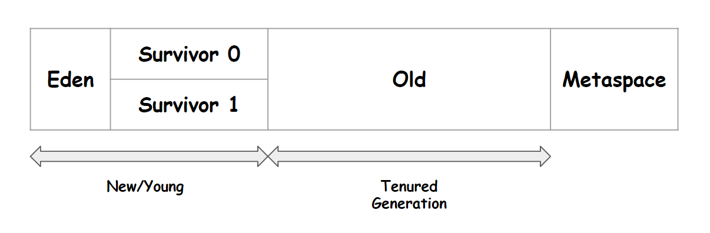

# Minor GC, Major GC, 객체의 생존 흐름
{: .no_toc }

## Table of contents
{: .no_toc .text-delta }

1. TOC
{:toc}

---

 

### 참고자료
{: .fs-6 .fw-700 }
- [Oracle.com - Getting Started With the G1 Garbage Collector](https://www.oracle.com/technetwork/tutorials/tutorials-1876574.html)
- [https://1-7171771.tistory.com/140](https://1-7171771.tistory.com/140)
 
 

### 가비지(Garbage) 란?
{: .fs-6 .fw-700 }
Oracle 의 Java SE 8 GC 튜닝 가이드에서는 가비지를 아래와 같이 이야기하고 있다.

> An object is considered garbage when it can no longer be reached from any pointer in the running program.

실행중인 프로그램에서 더 이상 어떤 포인터로도 접근이 불가능한 객체를 가비지(Garbage)로 간주합니다. 

즉, **더 이상 참조되고 있지 않은 객체**는 광활한 힙 안에서 참조하는 변수 없이 혼자 있는다. 이런 객체를 가비지(Garbage)라고 부른다. 
 
 

### 가비지 컬렉션
{: .fs-6 .fw-700 }

힙 영역에 저장되는 데이터는 프로그래머가 직접 할당할 수는 있지만 직접 해제하는 것은 불가능하다. JVM이 직접 관리한다. JVM은 살아있는 객체(live objects) 외에는 모두 가비지로 간주한다. 참조되고 있지 않은 객체는 접근 불가능(unreachable)하다고 판단하고 해당 객체를 삭제하여 메모리 공간을 획득한다. 
 

### Minor GC, Major GC
{: .fs-6 .fw-700 }

#### Minor GC
{: .fs-5 .fw-700 }
- New/Young 영역에서 발생하는 GC
- Eden, Survivor0, Survivor1 영역에서 사용되지 않는 객체들을 삭제하는 것을 MinorGC라고 부른다.

 

#### Major GC(Full GC)
{: .fs-5 .fw-700 }
- Old 영역에서는 2차 GC라고 불리는 `Major GC` 가 발생한다
- GC 작업을 진행하는 Thread 를 제외하고 그 외의 모든 Thread 를 멈춘 후 GC를 진행한다.
- 이 때 GC를 수행하는 Thread 외의 모든 Thread가 멈추는 현상을 `Stop the World` 라고 부른다.
 
GC 알고리즘을 어떤 것을 사용하더라도 `Stop the world` 를 피하는 것은 불가능하다. 
GC 튜닝을 하는 목적은 바로 `Stop the world` 에 소요되는 시간을 최소한도로 줄이기 위함이다. 
 

### Major GC, Minor GC를 거칠 때 객체의 생존 흐름
{: .fs-6 .fw-700 }
힙 메모리에서의 GC 가 동작하는 흐름은 아래와 같다. 이 그림은 [https://1-7171771.tistory.com/140](https://1-7171771.tistory.com/140) 에서 가져왔는데, 그림의 원본이 어디인지 찾아보다가 결국 포기했다. 그래서 그림의 출처를 이번 글에 포함하지 못했다. 구글이미지 검색으로 찾아봤을 때 아래 그림보다 더 직관적으로 설명하는 그림이 없어서 출처가 불명확하지만 가져왔다. 

