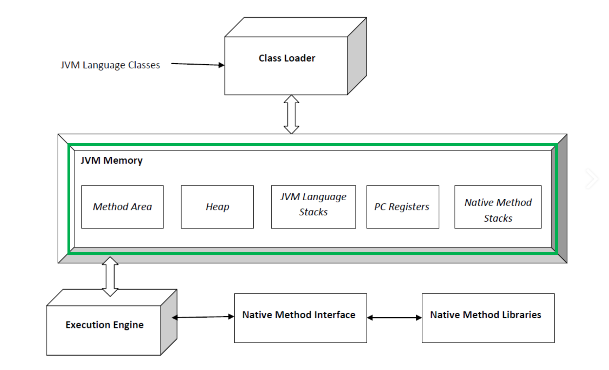

# JVM 의 각 모듈들
{: .no_toc }

## Table of contents
{: .no_toc .text-delta }

1. TOC
{:toc}

---

 

### 참고자료
{: .fs-6 .fw-700 }

 
 

### JVM 의 모듈들
{: .fs-6 .fw-700 }

JVM 의 주요 모듈들을 크게 분류해서 표현해보면 아래와 같다.
아래 그림에서 초록색으로 표시한 부분은 런타임 데이터 영역이라고 부르는데, 오늘 자세하게 정리해볼 영역이다.

### Runtime Data Area
{: .fs-6 .fw-700 }

#### Method Area (메서드 영역)
{: .fs-5 .fw-700 }
- 필드 정보 : 클래스 멤버 필드명, 데이터 타입, 접근 제어자 등의 필드 정보
- 메서드 정보 : 메서드의 이름, 리턴 타입, 파라미터, 접근 제어자 등의 메서드 정보
- Type 정보 : interface 인지, class 인지
- **Constant Pool (상수 풀)** : 문자상수, 타입, 필드, 객체 참조가 저장된다.
  - e.g. String Constant Pool
- 이 외에도 **static 변수**, **final class 변수** 들이 생성된다.
 

#### Heap Area (힙 영역)
{: .fs-5 .fw-700 }
- new 연산으로 생성된 인스턴스가 생성되는 영역
- 메서드 영역에 로드된 클래스만 생성 가능하다.
- Garbage Collector 는 힙 영역에서 사용되지 않는 부분들을 검사해서 제거하는 작업을 수행한다.
- 힙 영역은 Eden, Survivor, Tenured, Permanent 또는 Metaspace 영역으로 나뉜다.
- Java 8 이후로 Permanent 영역은 없어졌고 Permanent 가 관리하는 데이터 중 일부는 Metaspace(native 영역)로 이관되거나 Java Heap 에 저장되게 되었다.
 

#### Stack Area (스택 영역)
{: .fs-5 .fw-700 }
- **지역변수, 파라미터, 리턴값, 연산**을 위한 임시값 등을 생성하는 영역이다.
- int a = 10; 이라는 소스를 작성하면 정수 값이 할당 될 수 있는 메모리 공간을 a 라고 잡아두고 그 메모리 영역에 값이 10이 들어간다. 스택에 메모리 이름을 a 라고 붙여두고 값이 10인 메모리 공간을 만든다.
- Product p = new Product(); 라는 소스를 작성하면 Product p 는 스택 영역에 생성되고, new 로 생성된 Product 인스턴스는 힙 영역에 생성된다.
  - 이 때 스택 영역에 생성된 p 가 힙 영역에 생성된 객체를 가리키고 있는다.
  - 메서드를 호출할 때마다 개별적으로 스택이 생성된다.
 
 

#### PC Register (PC 레지스터)
{: .fs-5 .fw-700 }
스레드가 생성될 때마다 생성되는 영역이다. Program Counter이다.
각 스레드의 JVM 인스트럭션 주소가 저장되어 있다.
현재 스레드가 실행되는 부분의 주소와 명령을 저장하고 있는 영역이다. (CPU의 레지스터와는 다른 개념이다.)
 
 

#### Native Method Stack
{: .fs-5 .fw-700 }
JNI처럼 c/c++ 등 과 같은 자바 언어 외의 언어로 작성된 네이티브 코드를 위한 메모리 영역이다.
 
 

### 그 외의 영역의 모듈들
{: .fs-6 .fw-700 }
- 실행엔진 (Execution Engine)
- 가비지 컬렉터 (Garbage Collector, GC)
 
 

#### 실행엔진 (Execution Engine)
{: .fs-5 .fw-700 }
- 클래스 로더가 Runtime Data Area 에 적재한 클래스(바이트 코드)를 기계어로 변경해서 명령어 단위로 실행하는 역할을 수행한다.
- 명령어를 하나 하나 실행하는 인터프리터(Interpreter) 방식, JIT(Just In Time) 컴파일러를 이용하는 방식이 있다.
 
 

#### 가비지컬렉터 (Garbage Collector, GC)
{: .fs-5 .fw-700 }
- Heap 메모리 영역에 생성(적재)된 객체 들 중 참조되지 않는 객체들을 탐색 후 제거하는 역할을 수행
- GC가 동작하는 시점은 정확히 알 수 없다.
- GC 가 수행되는 동안 GC를 수행하는 스레드가 아닌 모든 스레드가 정지된다.
- Full GC가 일어나서 몇 초간 모든 스레드가 정지하게 되면 장애로 이어지는 치명적인 문제가 발생할 수 있다. (Stop the world)
 
 
